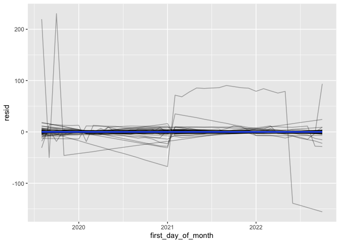
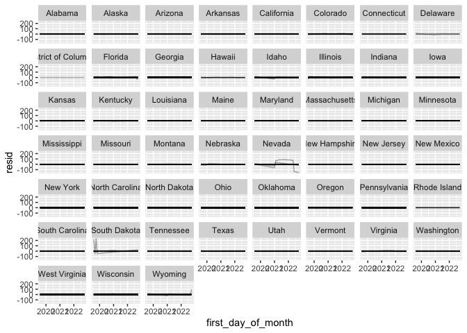
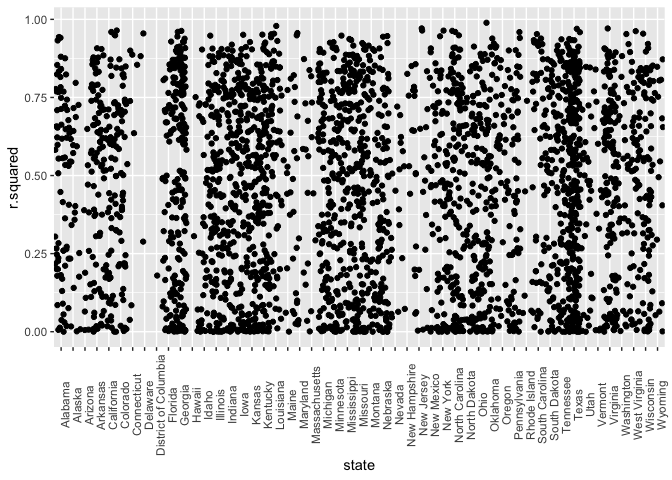

godaddy nested data
================
christian reetz
2023-01-25

``` r
library(readr)
census_starter <- read_csv("GoDaddy/godaddy-microbusiness-density-forecasting/census_starter.csv")
```

    ## Rows: 3142 Columns: 26
    ## ── Column specification ────────────────────────────────────────────────────────
    ## Delimiter: ","
    ## dbl (26): pct_bb_2017, pct_bb_2018, pct_bb_2019, pct_bb_2020, pct_bb_2021, c...
    ## 
    ## ℹ Use `spec()` to retrieve the full column specification for this data.
    ## ℹ Specify the column types or set `show_col_types = FALSE` to quiet this message.

``` r
train <- read_csv("GoDaddy/godaddy-microbusiness-density-forecasting/train.csv")
```

    ## Rows: 122265 Columns: 7
    ## ── Column specification ────────────────────────────────────────────────────────
    ## Delimiter: ","
    ## chr  (3): row_id, county, state
    ## dbl  (3): cfips, microbusiness_density, active
    ## date (1): first_day_of_month
    ## 
    ## ℹ Use `spec()` to retrieve the full column specification for this data.
    ## ℹ Specify the column types or set `show_col_types = FALSE` to quiet this message.

``` r
test <- read_csv("GoDaddy/godaddy-microbusiness-density-forecasting/test.csv")
```

    ## Rows: 25080 Columns: 3
    ## ── Column specification ────────────────────────────────────────────────────────
    ## Delimiter: ","
    ## chr  (1): row_id
    ## dbl  (1): cfips
    ## date (1): first_day_of_month
    ## 
    ## ℹ Use `spec()` to retrieve the full column specification for this data.
    ## ℹ Specify the column types or set `show_col_types = FALSE` to quiet this message.

### Nested Data

# Nested Data Frames by County

``` r
library(modelr)
library(tidyverse)
```

    ## ── Attaching packages ─────────────────────────────────────── tidyverse 1.3.2 ──
    ## ✔ ggplot2 3.4.0      ✔ dplyr   1.0.10
    ## ✔ tibble  3.1.8      ✔ stringr 1.5.0 
    ## ✔ tidyr   1.2.1      ✔ forcats 0.5.2 
    ## ✔ purrr   1.0.1      
    ## ── Conflicts ────────────────────────────────────────── tidyverse_conflicts() ──
    ## ✖ dplyr::filter() masks stats::filter()
    ## ✖ dplyr::lag()    masks stats::lag()

``` r
library(dplyr)
library(gapminder)
```

\#Nest

``` r
by_county <- train %>%
  group_by(cfips, state) %>%
  nest()
```

\#Model-fitting function

``` r
county_model <- function(df) {
  lm(microbusiness_density ~ first_day_of_month, data = df)
}
```

\#Apply to each element

``` r
models <- map(by_county$data, county_model)
```

\#Adding models to dataframe

``` r
by_county <- by_county %>%
  mutate(model = map(data, county_model))
```

``` r
by_county %>% 
  filter(state == "Texas")
```

    ## # A tibble: 254 × 4
    ## # Groups:   cfips, state [254]
    ##    cfips state data              model 
    ##    <dbl> <chr> <list>            <list>
    ##  1 48001 Texas <tibble [39 × 5]> <lm>  
    ##  2 48003 Texas <tibble [39 × 5]> <lm>  
    ##  3 48005 Texas <tibble [39 × 5]> <lm>  
    ##  4 48007 Texas <tibble [39 × 5]> <lm>  
    ##  5 48009 Texas <tibble [39 × 5]> <lm>  
    ##  6 48011 Texas <tibble [39 × 5]> <lm>  
    ##  7 48013 Texas <tibble [39 × 5]> <lm>  
    ##  8 48015 Texas <tibble [39 × 5]> <lm>  
    ##  9 48017 Texas <tibble [39 × 5]> <lm>  
    ## 10 48019 Texas <tibble [39 × 5]> <lm>  
    ## # … with 244 more rows

\#Adding residuals of each model

``` r
by_county <- by_county %>%
  mutate(
    resids = map2(data, model, add_residuals)
  )
```

\#Unnesting

``` r
resids <- unnest(by_county, resids)
```

\#Plotting the residuals

``` r
resids %>%
  ggplot(aes(first_day_of_month, resid)) +
  geom_line(aes(group = cfips), alpha = 1/3) +
  geom_smooth(se = FALSE)
```

    ## `geom_smooth()` using method = 'gam' and formula = 'y ~ s(x, bs = "cs")'

<!-- -->

\#Facetting by state

``` r
resids %>% 
  ggplot(aes(first_day_of_month, resid, group = cfips)) +
  geom_line(alpha = 1/3) +
  facet_wrap(~state)
```

<!-- -->

\#Extracting model quality

``` r
glance <- by_county %>% 
  mutate(glance = map(model, broom::glance)) %>%
  unnest(glance)
```

\#Arrange by R square

``` r
glance %>% 
  arrange(r.squared)
```

    ## # A tibble: 3,135 × 17
    ## # Groups:   cfips, state [3,135]
    ##    cfips state    data     model resids   r.squ…¹ adj.r…²  sigma stati…³ p.value
    ##    <dbl> <chr>    <list>   <lis> <list>     <dbl>   <dbl>  <dbl>   <dbl>   <dbl>
    ##  1 30099 Montana  <tibble> <lm>  <tibble> 5.95e-8 -0.0270 0.101  2.20e-6   0.999
    ##  2 49005 Utah     <tibble> <lm>  <tibble> 1.76e-7 -0.0270 0.180  6.50e-6   0.998
    ##  3 48467 Texas    <tibble> <lm>  <tibble> 2.23e-6 -0.0270 0.0779 8.24e-5   0.993
    ##  4 48147 Texas    <tibble> <lm>  <tibble> 3.23e-6 -0.0270 0.122  1.19e-4   0.991
    ##  5 47111 Tenness… <tibble> <lm>  <tibble> 3.81e-6 -0.0270 0.0469 1.41e-4   0.991
    ##  6 31183 Nebraska <tibble> <lm>  <tibble> 1.53e-5 -0.0270 0.0888 5.65e-4   0.981
    ##  7  1081 Alabama  <tibble> <lm>  <tibble> 1.58e-5 -0.0270 0.0720 5.85e-4   0.981
    ##  8 39091 Ohio     <tibble> <lm>  <tibble> 1.73e-5 -0.0270 0.0484 6.41e-4   0.980
    ##  9 36053 New York <tibble> <lm>  <tibble> 2.79e-5 -0.0270 0.0642 1.03e-3   0.975
    ## 10 51013 Virginia <tibble> <lm>  <tibble> 4.07e-5 -0.0270 0.417  1.51e-3   0.969
    ## # … with 3,125 more rows, 7 more variables: df <dbl>, logLik <dbl>, AIC <dbl>,
    ## #   BIC <dbl>, deviance <dbl>, df.residual <int>, nobs <int>, and abbreviated
    ## #   variable names ¹​r.squared, ²​adj.r.squared, ³​statistic

\#Plot worst r squared

``` r
glance %>% 
  ggplot(aes(state, r.squared)) +
  geom_jitter(width = 0.5) +
  theme(axis.text.x = element_text(angle = 90))
```

<!-- -->

\#Fable \#Load packages

\#Keeping tibble format

t
